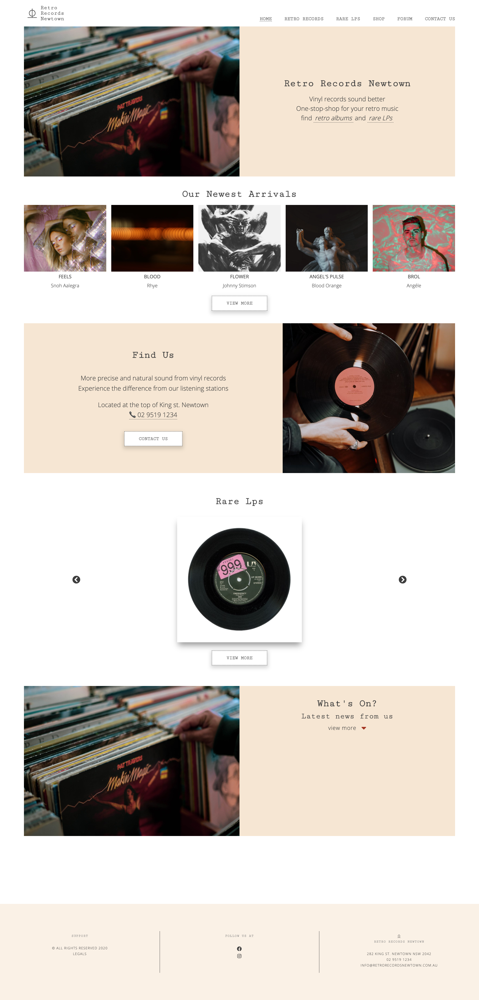
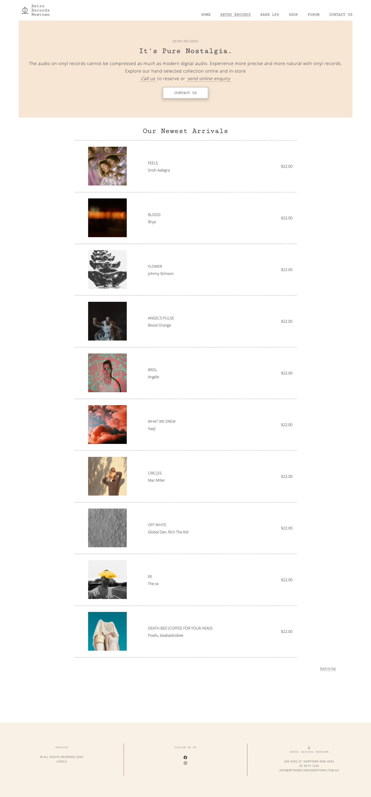
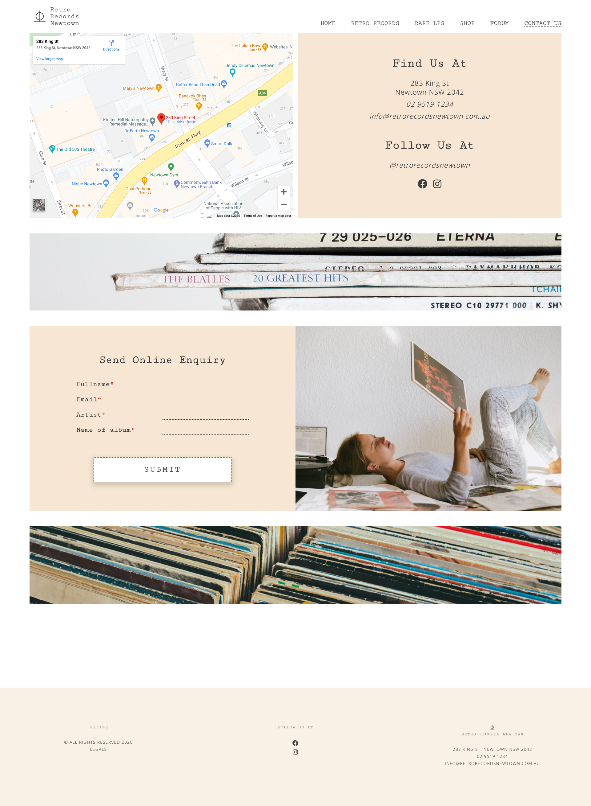
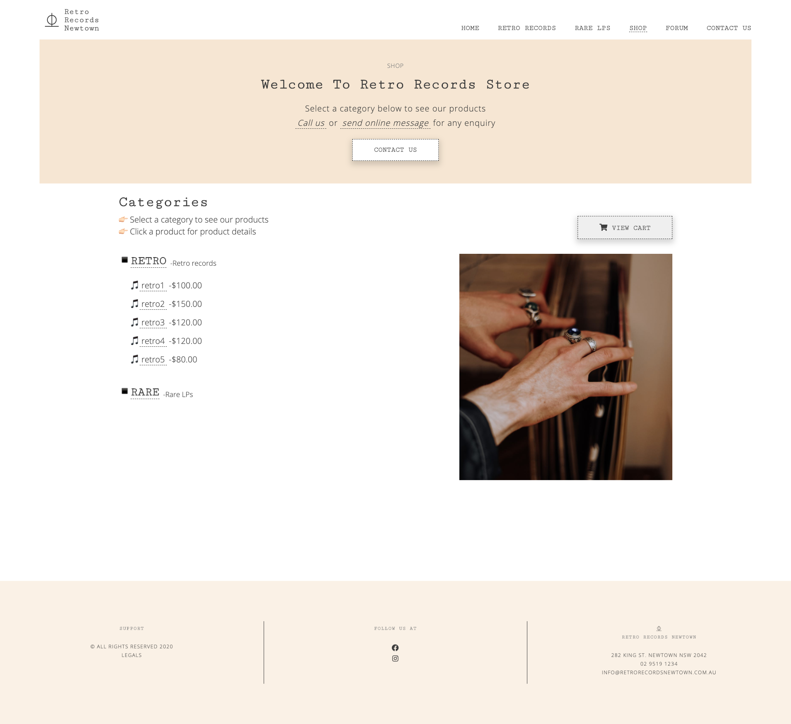
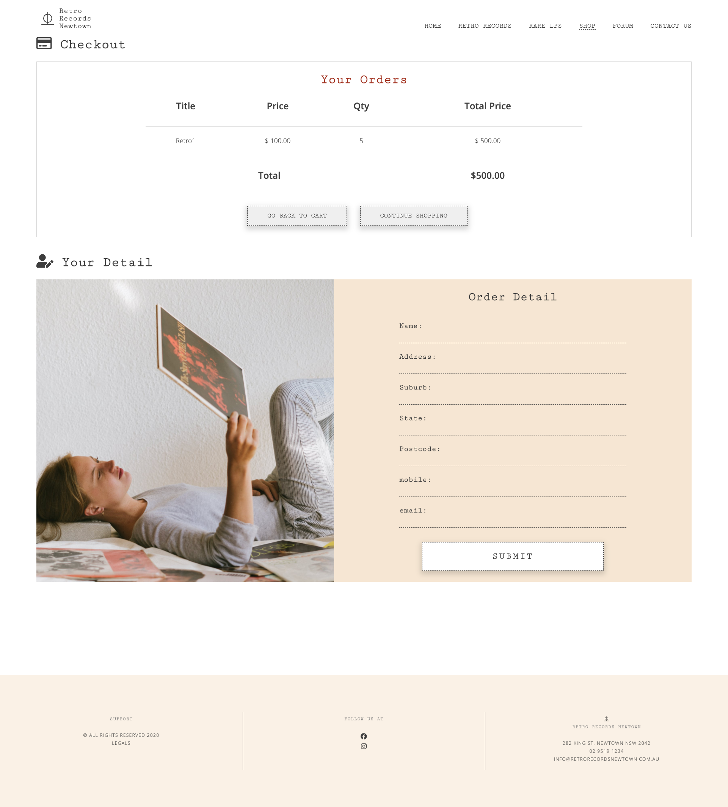
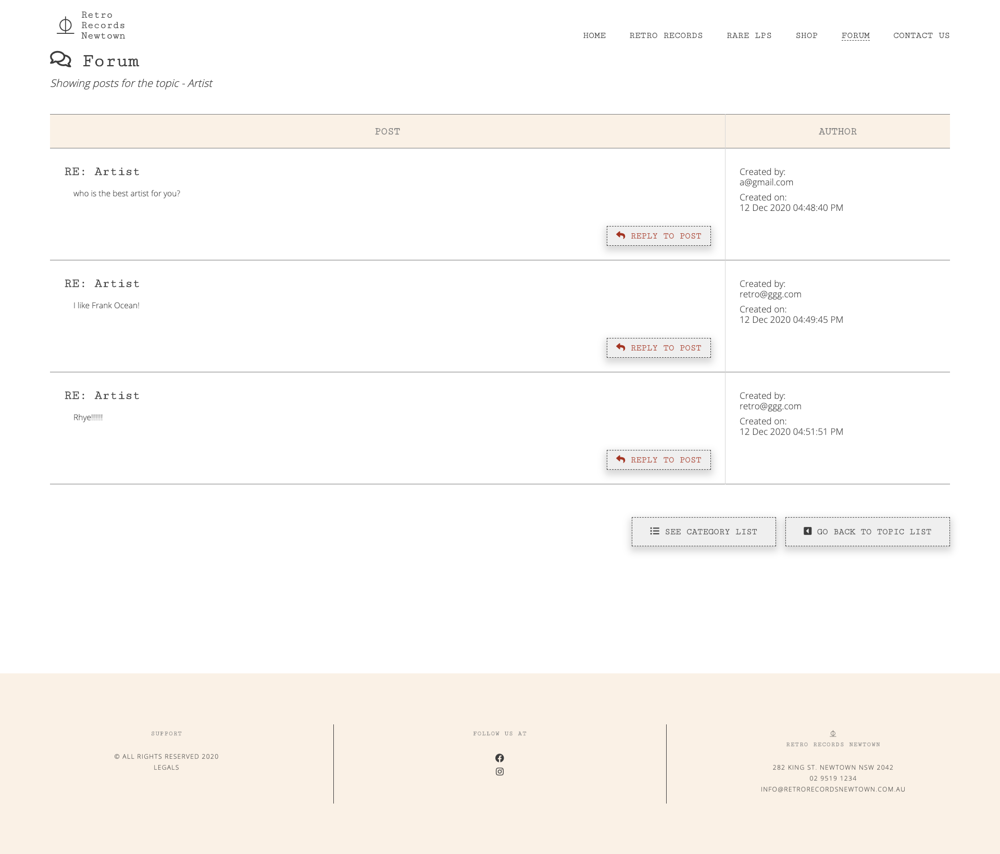

# RetroRecords

## a mock website for Retro Records Newtown

used HTML, SCSS, Vanilla JavaScript, php, MySql and Ajax

forum and shopping cart features

### Sample pages

| Home                                                      |
| :-------------------------------------------------------- |
|  |

| Records                                                            |
| :----------------------------------------------------------------- |
|  |

| Rare Records                                                              |
| :------------------------------------------------------------------------ |
|  |

| Contact                                                            |
| :----------------------------------------------------------------- |
|  |

| Store                                                        |
| :----------------------------------------------------------- |
|  |

| Store-checkout                                                                          |
| :-------------------------------------------------------------------------------------- |
|  |

| Forum                                                        |
| :----------------------------------------------------------- |
|  |
